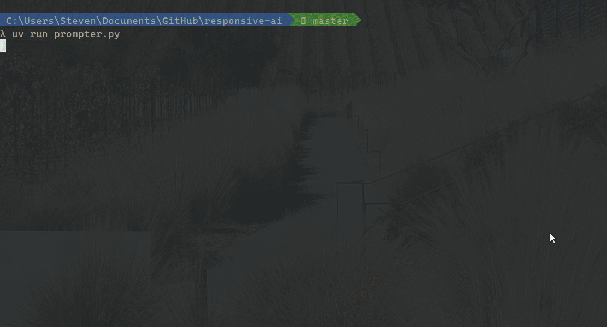

# 🎙️ Responsive AI

Responsive AI is very much the lightweight open-source version of [Cluely](https://cluely.com/) before the hype. Run as a **local, real-time speech-to-LLM assistant** powered entirely by **open-source models**. Speak to your computer → get instant answers back from an offline LLM — no accounts, no paid APIs.

Built with:

- **[`faster-whisper`](https://github.com/SYSTRAN/faster-whisper)** — GPU‑accelerated, low‑latency speech-to-text
- **[Ollama](https://ollama.com/)** — Run local LLMs (Gemma 3 & others) on your machine



## ✨ Features

- **Real-time** microphone capture → live transcription (partials + final commit)
- **In-context hotkey toggle**: decide when user input should be sent to the LLM
- **Open-source models only** — no closed API keys, no rate limits
- **Lightweight** — runs entirely on your local machine
- Easy to extend (custom prompts, text-to-speech, conversation memory, etc.)

## 👩‍💻 Running

```bash
uv sync                # Install all dependencies
uv run llm_prompter.py # Start the live transcriber + LLM
```

## Requirements

The following software needs to be installed on your local machine before running.

### 📦 Package Managers

We highly recommend the following:

- [**uv**](https://docs.astral.sh/uv/getting-started/installation/) – Blazing fast Python environment manager (written in Rust)

### 🤖 Local LLMs

- [**Ollama**](https://ollama.com/download) – A streamlined, open-source platform for running and managing LLMs on your local machine. It simplifies downloading, setting up, and interacting with open-source models

> ℹ️ Make sure Ollama is running in the background for LLM-based workflows.

### 🎙️ Audio to Text (Transcription)

To enable GPU-accelerated transcription with [`faster-whisper`](https://github.com/SYSTRAN/faster-whisper):

- NVIDIA GPU with sufficient VRAM for your chosen model
- NVIDIA GPU driver (version depends on your CUDA setup)
- [CUDA Toolkit](https://developer.nvidia.com/cuda-downloads) (typically version 11+)
- [cuDNN](https://developer.nvidia.com/cudnn-downloads) (sometimes bundled with CUDA)

To ensure PyTorch is installed with CUDA support:

```bash
uv pip install torch --index-url https://download.pytorch.org/whl/cu128 && uv sync
```

## Problem

This used to be a Next.js app that connected to OpenAI's GPT API and offered users access to ChatGPT without having to register. However, given their expiration on API keys, the only way to further access their API is by signing up for the paid version 🙄.

### 💡 Why Local + Open Source?

- You control your data (runs entirely offline if desired)
- No rate limits / API key expirations
- Full extensibility for custom workflows
- True to the spirit of OpenAI's founding principles

## Architecture and Design

```bash
🎤 Microphone
   ↓ (sounddevice)
[Audio Queue]
   ↓ (Silero VAD – Voice Activity Detection)
Partial transcript every X seconds
   ↓ (Whisper transcription)
Final transcript when speech ends
   ↓ if in_context = True
Send to Ollama (Gemma3 or other LLM)
   ↓
LLM Response → log/console/next step
```
